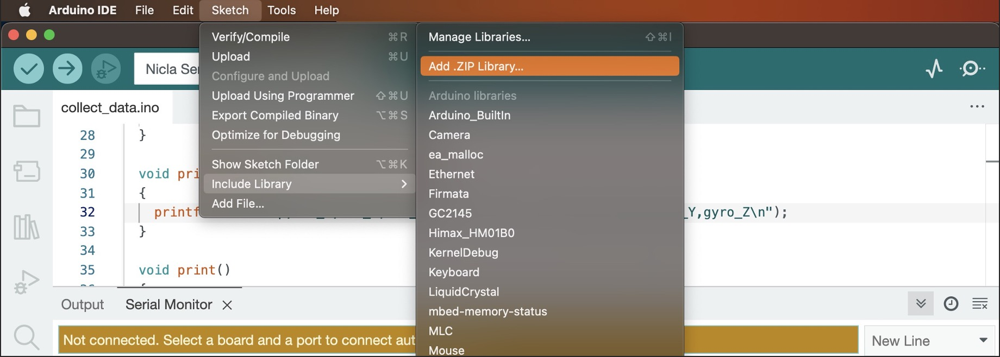
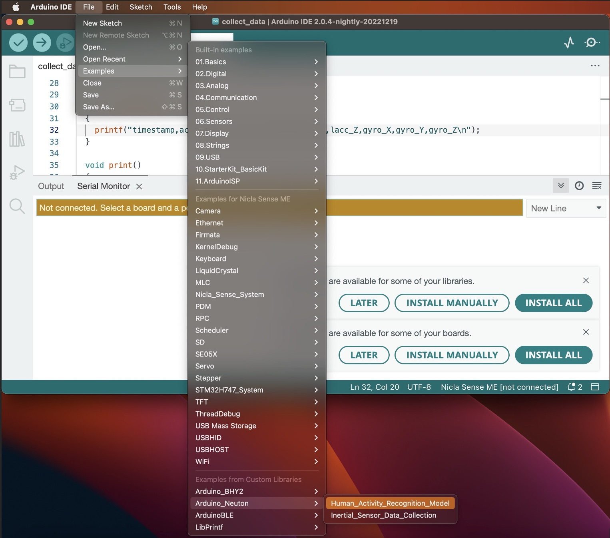
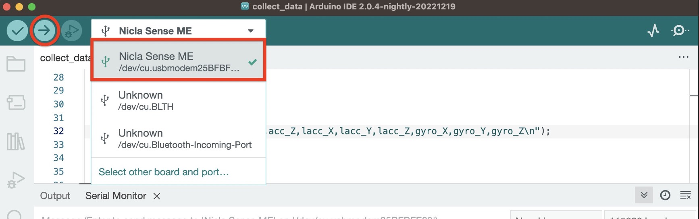

.. image:: logo.png

**hand-activity-recognition** is a public repository of a Neuton.ai company containing a pretrained hand activity recognition model.

Please refer to more successful Neuton.ai TinyML models on `hackster <https://www.hackster.io/neuton-tiny-machine-learning1>`_.

Within Neuton.ai TinyML lab we have developed a hand activity recognition model that can recongize 5 different activities:
- brushing hair
- brushing teet
- washing hands
- clapping
- random (all other movements)

The archive with the compiled model is contained in the 'model' directory. It can be downloaded by any user and embedded into Arduino Nicla Sense ME board with a few clicks of a mouse using the Arduino IDE. The model can then be inferenced with an MCU connected on the wrist of a user.

The data used for training the model had been collected from only 6 users (10 minutes of data for each corresponding class) and is capable to generalize on new (out of training sample) users with high accuracy.
The model uses accelerometer/linear accelerometers data collected with a Nicla Sense ME board.

Embeding manual
~~~~~~~~~~~~

1. Download the ‘Arduino_Neuton.zip’ archive from the 'model' directory. (Do not extract the archive)
2. Install and open the Arduino IDE
3. Install the ‘Arduino_Neuton.zip’ model into the Arduino IDE:
Sketch -> Include Library -> Add .ZIP Library… (point to the downloaded ‘Arduino_Neuton.zip’ archive)

4. Quit & restart the Arduino IDE (it will take up to a minute for the Arduino IDE to index all of it’s examples, including the freshly installed ‘Arduino_Neuton’)
5. Open the installed example: File -> Examples -> Arduino_Neuton -> Human_Activity_Recognition_Model (a new Arduino IDE window will pop up, close the previous Arduino IDE window) 

5. Connect you Nicla Sense ME to your computer’s USB port
6. In the IDE select your MCU and upload the firmware

7. After the firmware is uploaded (1-2 minutes), open the Serial Monitor and begin testing the model. (In case you will see the connection error – restart the Arduino IDE and open the Serial Monitor once again)

8. Test the model - perform the desired activity
9. The model will output the corresponding class and its probability

Please refer to the video example of inferencing the model.

Development
-----------

We welcome new contributors of all experience levels. The NeutonTinyML
community goals are to be helpful, welcoming, and effective. The
`Development Guide <https://scikit-learn.org/stable/developers/index.html>`_
has detailed information about contributing code, documentation, tests, and
more.

Important links
---------------

- Official source code repo: https://github.com/NeutonTinyML/hand-activity-recognition.git
- Issue tracker: https://github.com/NeutonTinyML/hand-activity-recognition/issues

Source code
-----------

You can check the latest sources with the command::

    git clone https://github.com/NeutonTinyML/hand-activity-recognition.git

Communication
-------------

- Neuton.ai web site: https://neuton.ai/
- LinedIn: https://www.linkedin.com/company/neuton/mycompany/verification/
- Facebook: https://www.facebook.com/NeutonAI
- Twitter: https://twitter.com/NeutonAI
- Slack: https://neutonautoml.slack.com/join/shared_invite/zt-19zmrhmwk-51llYk09u18soU_kdIiJvg#/shared-invite/email
- Hackster: https://www.hackster.io/neuton-tiny-machine-learning1
- YouTube: https://www.youtube.com/channel/UCtkEpWMAplbzQZYTAdVmL_Q

Citation
--------

If you use NeutonTinyML models in a media/research publication, we would appreciate citations to the following: neuton.ai.