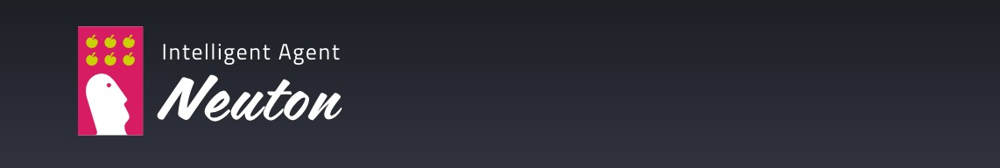

**hand-activity-recognition** is a public repository of a Neuton.ai company containing a pretrained hand activity recognition model.

Within Neuton.ai TinyML lab we have developed a hand activity recognition model that can recongize 5 different activities:
- brushing hair
- brushing teet
- washing hands
- clapping
- random (all other movements)

The archive with the model is contained in the 'model' directory in the form of a precompiled Arduino Sketch.
It can be downloaded by any user and embedded into Arduino Nicla Sense ME board with a few clicks of a mouse using the Arduino IDE.
The model can then be inferenced with an MCU connected on the wrist of a user.

The data used for training the model had been collected from only 6 users (10 minutes of data for each corresponding class) and is capable to generalize on new (out of training sample) users with high accuracy.
The model uses accelerometer/linear accelerometers data collected with a Nicla Sense ME board.

Embeding manual
~~~~~~~~~~~~

1. Download the model from the 'model' directory
2. Install the Arduino IDE
3. Open the file run_inf_int_win.ino from the downloaded archive
4. Select the Nicla Sense ME board from the drop-down menu
.. image:: embed-manual-1.jpeg
5. Click on the 'Upload' button
.. image:: embed-manual-2.jpeg
6. Open the Serial Monitor
7. Perform the desired activity
8. The model will output the corresponding class and its probability
.. image:: embed-manual-3.jpeg

Please refer to the video example of inferencing the model.

**boilerplate-code contains:**

- PasswordGenerator class that allows to generate random passwords
- more to come...

Development
-----------

We welcome new contributors of all experience levels. The boilerplatecode
community goals are to be helpful, welcoming, and effective. The
`Development Guide <https://scikit-learn.org/stable/developers/index.html>`_
has detailed information about contributing code, documentation, tests, and
more. We've included some basic information in this README.

Important links
---------------

- Official source code repo: https://github.com/NeutonTinyML/hand-activity-recognition.git
- Issue tracker: https://github.com/NeutonTinyML/hand-activity-recognition/issues

Source code
-----------

You can check the latest sources with the command::

    git clone https://github.com/NeutonTinyML/hand-activity-recognition.git

Communication
-------------

- Neuton.ai email: 
- Neuton.ai web site: https://neuton.ai/

Citation
--------

If you use NeutonTinyML models in a media/research publication, we would appreciate citations to the following: neuton.ai.